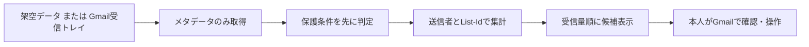

# 設計と判定規則

## 目的

第一優先は重要メールの見落としを減らすこと。第二優先は配信の削減と整理に要する時間の短縮。受信箱の未読件数をゼロにすること自体は目的にしない。

## データの流れ

ライブ接続では`gmail.metadata`だけを要求する。`messages.list`で新しい受信トレイのIDを取得し、`messages.get(format=metadata)`で`From`、`Subject`、`List-Id`を選択取得する。本文、添付、`List-Unsubscribe`ヘッダーは取得しない。Gmailの書き込みメソッドは呼ばない。OAuthトークンと個人用設定はGit対象外の`private/`に置く。

## 判定の順序

1. 保護する差出人、スター、Gmail重要マーク、個人カテゴリ、請求・予約・認証などの件名を検出したら保護候補にする。この判定を販促判定より先に行う。
2. Gmailの「プロモーション」カテゴリまたは販促語を検出する。
3. `List-Id`があれば配信リストとみなし、同じ差出人でもリストごとに集計する。
4. `List-Id`で配信を確認でき、全件が販促で保護候補がなく、指定された件数以上なら「配信停止を検討」。`List-Id`だけの配信は「後で読む設定を検討」。保護候補が混ざれば「配信設定を個別に確認」。それ以外は個別確認。
5. 同じ差出人に保護候補が別の配信リストで存在する場合、送信者単位の一括解除に注意を表示する。

提案はすべてレビュー用であり、**配信停止や削除を自動実行しない**。疑わしい配信は「必要メールを失う損失」が大きいため、維持・個別確認側に倒す。

## 調整できる変数

| 設定 | 初期値 | 意味 |
|---|---:|---|
| `protected_senders` | 空 | 常に保護候補とする完全一致のアドレス |
| `protect_keywords` | 日英の請求・注文・予約・認証など | 件名に含まれたら保護候補 |
| `promo_keywords` | 日英のセール・クーポンなど | 件名に含まれたら販促候補 |
| `min_unsubscribe_count` | 2 | 配信停止候補を提示する最低観測件数 |

この値は公開リポジトリ内で個人向けに編集せず、`private/policy.json`で上書きする。

## 既知の限界と改善案

- 同じ企業が複数のアドレスを使う場合、現版ではアドレスをまたいだ関連付けをしない。ドメイン名だけで安易に統合すると別組織を混ぜるため、明示的な企業辞書を個人用設定として追加する案がある。
- 件名の単語一致は誤判定する。継続利用するなら、本人の「維持・停止・後で読む」判断履歴からルールを調整する。ただし履歴の公開は禁止する。
- Gmailの重要マークも推定結果であり、正解データではない。例外を手動レビューする。
- 初回の候補表示の質を、誤った配信停止候補の数、重要メールの見落とし候補数、1件の判断に要する時間で評価する。未読削減数だけでは評価しない。
